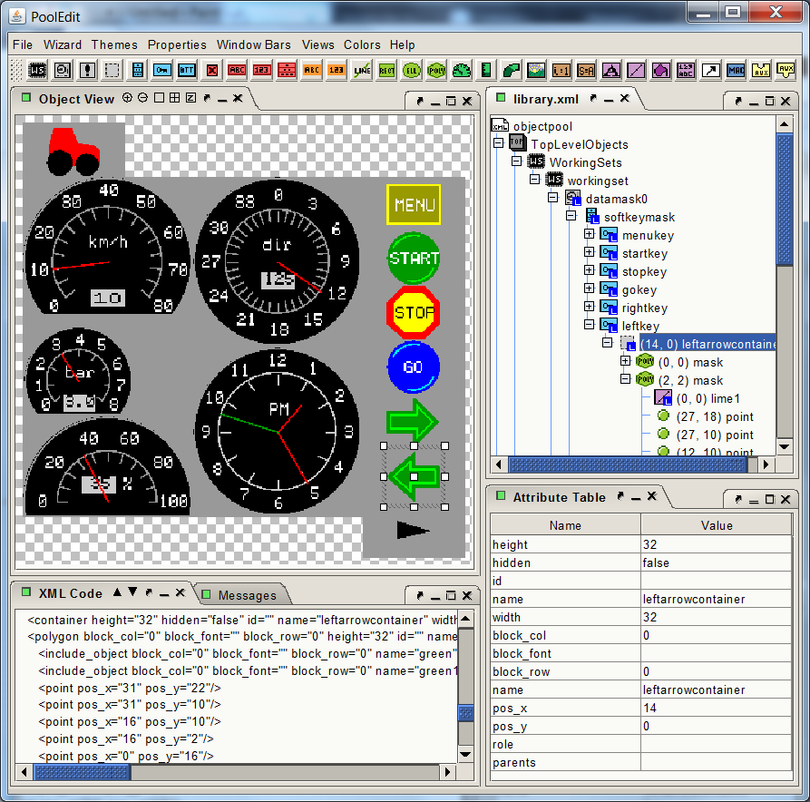

# PoolEdit

PoolEdit XML Graphical User Interface Editor for creating ISOBUS
object pools. In the ISO 11783 standard, the term _object pool_ refers
to a collection of graphical user interface objects which make up the
GUI. So to create ISOBUS user interfaces a tool is needed to edit the
object pool, hence the name PoolEdit.

The editor uses XML format internally as an editable data structure
and externally as a file format. The PoolEdit XML format is based on
the IsoAgLib format with some minor changes.

Please read the manual for more information!

Current development environment:
* OS: Windows 7 (but should work on Windows 10 as well)
* IDE: NetBeans 11.2
* Java: jdk-13.0.1

# PoolEdit Parser

The PoolEdit parser is a part of the implement control application
which:
* reads the XML document
* generates the ISO 11783 binary presentation
* and load it to the virtual terminal.

Because the XML file is parsed at runtime when the VT properties are
known, the PoolEdit parser can resize the GUI objects and reduce the
number of colors accordingly. Another benefit of the XML format is
that it allows the use of symbolic names for referencing the GUI
objects.  The symbolic names are easier to remember than numetic IDs
used in the binary object pool format.
